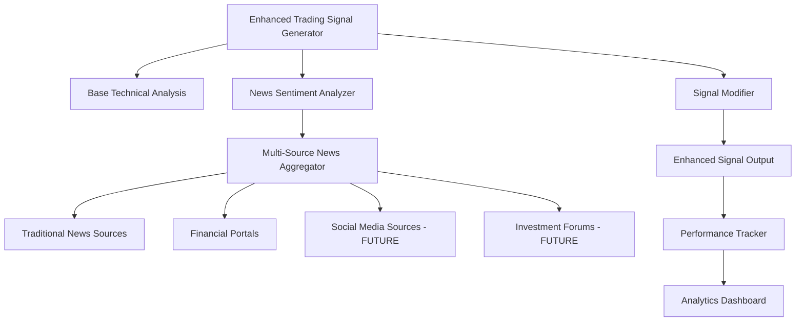

# 🔧 Technical Specification - Enhanced Trading Signals

## 📐 **ARCHITECTURE OVERVIEW**



## 🗂️ **FILE STRUCTURE**

```
apps/analysis/
├── enhanced_trading_signals.py          # NEW - Main enhanced generator
├── news_impact_analyzer.py             # NEW - News analysis logic
├── news_sources/                        # NEW - Multi-source architecture
│   ├── __init__.py
│   ├── base.py                         # Abstract interfaces
│   ├── traditional_news_source.py     # Current news integration
│   ├── financial_portals_source.py    # Stooq, Bankier, etc.
│   ├── social_media_source.py         # FUTURE - Twitter, LinkedIn
│   └── forum_source.py                # FUTURE - Investment forums
├── performance_tracking.py             # MODIFIED - Enhanced metrics ✅
└── daily_trading_signals.py           # UNCHANGED - Backward compatibility
```

## 📋 **DETAILED CLASS SPECIFICATIONS**

### **1. EnhancedDailyTradingSignalGenerator**

```python
# File: apps/analysis/enhanced_trading_signals.py
from decimal import Decimal
from typing import Dict, List, Optional, Any
from datetime import datetime, timedelta
from apps.analysis.daily_trading_signals import DailyTradingSignalGenerator
from apps.analysis.news_impact_analyzer import NewsImpactAnalyzer

class EnhancedDailyTradingSignalGenerator(DailyTradingSignalGenerator):
    """
    Enhanced trading signal generator with news sentiment integration.
    
    CONFIGURATION PARAMETERS:
    - NEWS_SENTIMENT_BOOST_THRESHOLD = 0.5     # Positive news threshold
    - NEWS_SENTIMENT_PENALTY_THRESHOLD = -0.5  # Negative news threshold  
    - HIGH_IMPACT_NEWS_MULTIPLIER = 1.5        # Multiplier for high impact news
    - NEWS_CONFIDENCE_BOOST = Decimal('15.0')  # Confidence boost for positive news
    - NEWS_CONFIDENCE_PENALTY = Decimal('20.0') # Confidence penalty for negative news
    
    WORKFLOW:
    1. Generate base technical signal (unchanged from parent)
    2. Analyze news sentiment for the stock (last 7 days)
    3. Apply modifications based on news analysis
    4. Return enhanced signal with news metadata
    """
    
    # News analysis parameters
    NEWS_SENTIMENT_BOOST_THRESHOLD = 0.5
    NEWS_SENTIMENT_PENALTY_THRESHOLD = -0.5
    HIGH_IMPACT_NEWS_MULTIPLIER = 1.5
    NEWS_CONFIDENCE_BOOST = Decimal('15.0')
    NEWS_CONFIDENCE_PENALTY = Decimal('20.0')
    NEWS_ANALYSIS_WINDOW_DAYS = 7
    
    def __init__(self):
        super().__init__()
        self.news_analyzer = NewsImpactAnalyzer()
        
    def generate_signals_for_stock(
        self, 
        stock: StockSymbol, 
        trading_session: Optional[TradingSession] = None
    ) -> Dict[str, Any]:
        """
        Generate enhanced trading signal with news analysis.
        
        Returns:
        {
            # Original fields from base generator
            'signal': 'BUY|SELL|HOLD',
            'confidence': 75,  # Modified by news
            'reason': 'Technical analysis | News impact',
            'indicators': {...},
            'risk_management': {...},
            
            # New fields for news analysis
            'news_analysis': {
                'sentiment_score': 0.65,
                'confidence': 0.85,
                'news_count': 4,
                'impact_level': 'high',
                'summary': 'Positive sentiment from 4 articles',
                'recent_news': [...]
            },
            'news_impact': ['News sentiment boost (+15% confidence)'],
            'signal_modified_by_news': False,
            'confidence_modified_by_news': 15,
            'enhanced_version': 'v1.0'
        }
        """
        
    def _analyze_stock_news_sentiment(self, stock: StockSymbol) -> Dict[str, Any]:
        """
        Analyze news sentiment for stock in the last 7 days.
        
        ALGORITHM:
        1. Find all news mentioning this stock (last 7 days)
        2. Get AI classifications (NewsClassification + StockSentiment)
        3. Calculate weighted average sentiment (recency + impact weights)
        4. Determine impact level based on news volume and quality
        5. Extract recent news for context
        
        Returns detailed news analysis dictionary
        """
        
    def _apply_news_analysis_to_signal(
        self, 
        base_signal: Dict[str, Any], 
        news_analysis: Dict[str, Any],
        stock: StockSymbol
    ) -> Dict[str, Any]:
        """
        Apply news-based modifications to technical signal.
        
        MODIFICATION RULES:
        
        POSITIVE NEWS (sentiment > 0.5):
        - BUY signal: +15% confidence (+22.5% for high-impact news)
        - SELL → HOLD (if sentiment > 0.7 AND high impact)  
        - HOLD → BUY (if sentiment > 0.8 AND very high impact)
        
        NEGATIVE NEWS (sentiment < -0.5):
        - BUY → HOLD (if sentiment < -0.7 AND high impact)
        - BUY signal: -20% confidence (for moderate negative)
        - SELL signal: +15% confidence (news confirms sell)
        - HOLD → SELL (if sentiment < -0.8 AND very high impact)
        
        HIGH IMPACT NEWS (regardless of sentiment):
        - Additional +5% confidence boost for high quality information
        
        CONFIDENCE BOUNDS:
        - Always keep confidence between 0-100%
        - Never modify signals with 0% confidence (insufficient technical data)
        """
```

### **2. NewsImpactAnalyzer**

```python
# File: apps/analysis/news_impact_analyzer.py
from typing import Dict, List, Optional, Any
from datetime import date, timedelta
from apps.core.models import StockSymbol
from apps.scrapers.models import NewsArticleModel
from apps.core.models import NewsClassification, StockSentiment

class NewsImpactAnalyzer:
    """
    Centralized news analysis engine.
    Handles multi-source news aggregation and impact assessment.
    """
    
    def __init__(self):
        self.source_weights = {
            'stooq': 1.0,           # Official financial news
            'strefainwestorow': 0.8, # Financial portals
            'bankier': 0.8,         # Financial portals
            # Future sources:
            # 'twitter': 0.4,       # Social media
            # 'forums': 0.3,        # Investment forums
        }
    
    def analyze_stock_news_impact(
        self, 
        stock: StockSymbol, 
        analysis_window_days: int = 7
    ) -> Dict[str, Any]:
        """
        Main analysis method called by Enhanced Generator.
        
        STEPS:
        1. Get all news for stock in timeframe
        2. Filter by AI classification availability
        3. Calculate weighted sentiment scores
        4. Assess impact level and urgency
        5. Generate summary and recommendations
        """
        
    def _calculate_weighted_sentiment(
        self, 
        news_items: List[NewsArticleModel], 
        target_stock: StockSymbol
    ) -> float:
        """
        Calculate weighted average sentiment score.
        
        WEIGHTS:
        - Recency: max(0.1, 1.0 - (days_old / 7.0))
        - Impact: 1.5x for high/very_high impact news
        - Source reliability: from self.source_weights
        - Stock specificity: 2.0x if stock-specific sentiment available
        
        Returns: Weighted sentiment score (-1.0 to +1.0)
        """
        
    def _determine_impact_level(
        self, 
        news_count: int, 
        high_impact_count: int, 
        very_recent_count: int,
        avg_confidence: float
    ) -> str:
        """
        Determine overall impact level.
        
        CLASSIFICATION:
        - very_high: high_impact_count >= 2
        - high: high_impact_count >= 1  
        - medium: very_recent_count >= 2
        - low: regular news with good confidence
        - minimal: few/poor quality news
        """
```

### **3. Multi-Source News Architecture (Future)**

```python
# File: apps/analysis/news_sources/base.py
from abc import ABC, abstractmethod
from typing import Dict, List, Optional
from datetime import timedelta
from apps.core.models import StockSymbol

class NewsSourceInterface(ABC):
    """
    Abstract interface for all news sources.
    Enables easy addition of new sources without core logic changes.
    """
    
    @abstractmethod
    def get_sentiment_score(self, stock: StockSymbol, timeframe: timedelta) -> Optional[float]:
        """Get aggregated sentiment score for stock in timeframe."""
        pass
        
    @abstractmethod
    def get_impact_level(self, stock: StockSymbol, timeframe: timedelta) -> str:
        """Get impact level: minimal/low/medium/high/very_high."""
        pass
        
    @abstractmethod
    def get_news_count(self, stock: StockSymbol, timeframe: timedelta) -> int:
        """Get number of relevant news articles."""
        pass
        
    @abstractmethod
    def get_source_reliability(self) -> float:
        """Get reliability score for this source (0.0-1.0)."""
        pass
        
    @abstractmethod
    def get_recent_news_summary(
        self, 
        stock: StockSymbol, 
        timeframe: timedelta, 
        limit: int = 3
    ) -> List[Dict]:
        """Get recent news summaries for context."""
        pass

class TraditionalNewsSource(NewsSourceInterface):
    """
    Current implementation using NewsArticleModel + NewsClassification.
    Handles: Stooq, Strefainwestorow, official ESPI reports.
    """
    
class SocialMediaSource(NewsSourceInterface):
    """
    FUTURE: Social media sentiment analysis.
    
    SOURCES TO INTEGRATE:
    - Twitter/X: #PKN, #PKO hashtag monitoring
    - LinkedIn: Company page posts and engagement
    - Reddit: r/investing, r/SecurityAnalysis mentions
    - StockTwits: Real-time investor sentiment
    
    API INTEGRATIONS NEEDED:
    - Twitter API v2 (Academic Research track)
    - LinkedIn Marketing API
    - Reddit API (PRAW)
    - StockTwits API
    """
    
class InvestmentForumSource(NewsSourceInterface):  
    """
    FUTURE: Polish investment forum analysis.
    
    SOURCES TO INTEGRATE:
    - Bankier.pl forum discussions
    - GPWInfoStrefa.pl comments
    - Inwestor.pl user discussions
    - Money.pl forum posts
    
    TECHNICAL APPROACH:
    - Web scraping (BeautifulSoup + Selenium)
    - NLP sentiment analysis for Polish language
    - User credibility scoring
    - Thread importance ranking
    """
```

### **4. Performance Tracking Enhancements** ✅

```python
# File: apps/analysis/performance_tracking.py (Already implemented)

class SignalPerformanceAnalyzer:
    """
    ENHANCED METHODS:
    - analyze_news_impact_on_performance() ✅
    - _generate_news_integration_recommendation() ✅
    
    NEW METRICS:
    - signals_with_news vs signals_without_news comparison
    - Sentiment vs ROI correlation analysis  
    - News source reliability tracking
    - Impact level performance breakdown
    """
```

## 🗄️ **DATABASE MODIFICATIONS**

### **New Configuration Table:**

```sql
-- apps/analysis/migrations/XXXX_add_enhanced_signals_config.py
CREATE TABLE analysis_enhanced_signal_config (
    id SERIAL PRIMARY KEY,
    name VARCHAR(50) UNIQUE NOT NULL,
    
    -- News analysis parameters
    news_sentiment_boost_threshold DECIMAL(3,2) DEFAULT 0.5,
    news_sentiment_penalty_threshold DECIMAL(3,2) DEFAULT -0.5,
    high_impact_news_multiplier DECIMAL(3,2) DEFAULT 1.5,
    news_confidence_boost DECIMAL(4,1) DEFAULT 15.0,
    news_confidence_penalty DECIMAL(4,1) DEFAULT 20.0,
    news_analysis_window_days INTEGER DEFAULT 7,
    
    -- Source weights (JSON field)
    source_weights JSONB DEFAULT '{"stooq": 1.0, "strefainwestorow": 0.8, "bankier": 0.8}',
    
    -- Feature flags
    is_active BOOLEAN DEFAULT False,
    enable_signal_modification BOOLEAN DEFAULT True,
    enable_confidence_adjustment BOOLEAN DEFAULT True,
    enable_hold_to_buy_conversion BOOLEAN DEFAULT False,
    enable_buy_to_hold_conversion BOOLEAN DEFAULT True,
    
    created_at TIMESTAMP DEFAULT NOW(),
    updated_at TIMESTAMP DEFAULT NOW()
);

-- Default configuration
INSERT INTO analysis_enhanced_signal_config (name, is_active) 
VALUES ('default', true);
```

### **Enhanced TradingSignal Metadata:**

```sql
-- Extend existing TradingSignal model
ALTER TABLE analysis_trading_signals 
ADD COLUMN news_analysis JSONB,
ADD COLUMN signal_modified_by_news BOOLEAN DEFAULT False,
ADD COLUMN confidence_modified_by_news DECIMAL(4,1) DEFAULT 0,
ADD COLUMN enhanced_version VARCHAR(20);

-- Index for performance
CREATE INDEX idx_trading_signals_news_analysis 
ON analysis_trading_signals USING GIN (news_analysis);
```

## 🧪 **TESTING STRATEGY**

### **Unit Tests:**

```python
# tests/analysis/test_enhanced_trading_signals.py
class TestEnhancedTradingSignals:
    
    def test_positive_news_boosts_buy_signal(self):
        """Test that positive news increases BUY signal confidence."""
        # Setup: Create stock with positive news
        # Expected: BUY signal confidence increased by 15%
        
    def test_negative_news_prevents_risky_buy(self):
        """Test that very negative news converts BUY to HOLD."""
        # Setup: Create strong negative news (sentiment < -0.7, high impact)
        # Expected: BUY signal converted to HOLD
        
    def test_high_impact_news_multiplier(self):
        """Test that high impact news gets additional weight."""
        # Setup: Create high impact positive news
        # Expected: 22.5% confidence boost instead of 15%
        
    def test_no_modification_for_zero_confidence_signals(self):
        """Test that signals with 0% confidence are not modified."""
        # Setup: Create signal with insufficient technical data
        # Expected: No news modifications applied
        
    def test_confidence_bounds_respected(self):
        """Test that confidence never exceeds 0-100% bounds."""
        # Setup: Create signal with 95% confidence + positive news
        # Expected: Confidence capped at 100%
```

### **Integration Tests:**

```python
# tests/analysis/test_news_integration.py  
class TestNewsIntegration:
    
    def test_real_news_data_integration(self):
        """Test with actual news data from database."""
        
    def test_multiple_news_sources_aggregation(self):
        """Test weighted sentiment from multiple sources."""
        
    def test_performance_tracking_with_news(self):
        """Test that performance metrics include news data."""
```

## 📊 **MONITORING & ALERTING**

### **Key Metrics to Track:**

```python
MONITORING_METRICS = {
    'signal_generation': {
        'enhanced_signals_generated_per_day': 'Counter',
        'news_modified_signals_ratio': 'Gauge',
        'avg_news_processing_time_ms': 'Histogram', 
        'news_analysis_errors_per_day': 'Counter'
    },
    'performance': {
        'enhanced_vs_basic_accuracy_diff': 'Gauge',
        'news_sentiment_roi_correlation': 'Gauge',
        'signals_with_news_win_rate': 'Gauge',
        'signals_without_news_win_rate': 'Gauge'
    },
    'news_data': {
        'news_coverage_percentage': 'Gauge',
        'avg_news_per_stock_per_day': 'Gauge',
        'ai_classification_success_rate': 'Gauge'
    }
}
```

### **Alerts:**

```yaml
# monitoring/alerts.yml
alerts:
  - name: "News Analysis Processing Slow"
    condition: "avg_news_processing_time_ms > 500"
    severity: "warning"
    
  - name: "News Modified Signals Performing Poorly"  
    condition: "enhanced_vs_basic_accuracy_diff < -5"
    severity: "critical"
    
  - name: "Low News Coverage"
    condition: "news_coverage_percentage < 30"  
    severity: "warning"
```

## 🚀 **DEPLOYMENT CHECKLIST**

### **Pre-Deployment:**
- [ ] All unit tests pass
- [ ] Integration tests with real data pass
- [ ] Performance benchmarks acceptable (<100ms additional processing)
- [ ] Database migrations tested
- [ ] Monitoring dashboards configured
- [ ] Feature flags configured for rollback

### **Deployment:**
- [ ] Deploy to staging environment
- [ ] Run full test suite in staging
- [ ] Deploy to production with 10% traffic
- [ ] Monitor key metrics for 24h
- [ ] Gradual rollout: 25% → 50% → 100%

### **Post-Deployment:**
- [ ] Monitor enhanced signal performance for 1 week
- [ ] Compare A/B test results (enhanced vs basic)
- [ ] Collect user feedback
- [ ] Optimize parameters based on real data
- [ ] Document lessons learned

---

**TECHNICAL SPEC COMPLETE** ✅

Ready to implement the Enhanced Trading Signal Generator with full news integration!

**Next Step:** Create the first implementation file `enhanced_trading_signals.py` 🚀
