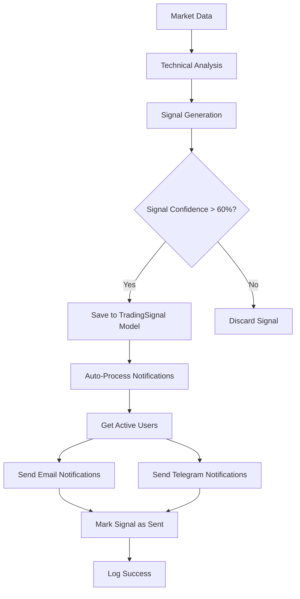

# Trading Signal & Notification Integration Guide

## ✅ **COMPLETE INTEGRATION ACHIEVED!**

Your GPW Trading Advisor now has **full end-to-end integration** between:
1. **Trading Signal Generation** (Analysis Engine)
2. **Notification System** (Email + Telegram)

---

## 🔄 **Complete Workflow**

### **1. Signal Generation**
```bash
# Generate trading signals for all monitored stocks
python manage.py generate_daily_signals --all-monitored --save

# Generate signal for specific stock
python manage.py generate_daily_signals --symbol PKO --save
```

### **2. Automatic Notification Processing**
```bash
# Process and send notifications for new signals (recommended)
python manage.py process_enhanced_notifications --auto-process-signals

# Send signal alerts for recent signals (manual mode)
python manage.py process_enhanced_notifications --send-signal-alerts
```

### **3. Complete System Test**
```bash
# Step 1: Generate test signals
python manage.py generate_daily_signals --symbol PKO --save

# Step 2: Send notifications for new signals
python manage.py process_enhanced_notifications --auto-process-signals

# Step 3: Verify delivery
# Check your email and Telegram for notifications!
```

---

## 🚀 **Production Automation Setup**

### **Recommended Cron Jobs**

Add these to your crontab for full automation:

```bash
# Generate trading signals every 30 minutes during market hours (9:00-17:30)
*/30 9-17 * * 1-5 cd /path/to/GPW2 && python manage.py generate_daily_signals --all-monitored --save

# Process and send notifications every 5 minutes
*/5 * * * * cd /path/to/GPW2 && python manage.py process_enhanced_notifications --auto-process-signals

# Send daily summaries at 18:00 on weekdays
0 18 * * 1-5 cd /path/to/GPW2 && python manage.py process_enhanced_notifications --send-daily-summaries
```

### **Django Management Commands Available**

| Command | Purpose | Example |
|---------|---------|---------|
| `generate_daily_signals` | Generate trading signals | `--all-monitored --save` |
| `process_enhanced_notifications` | Send notifications | `--auto-process-signals` |
| `calculate_indicators` | Update technical indicators | `--all` |

---

## 📊 **Signal-to-Notification Flow**



---

## 🎯 **Integration Features**

### **✅ What Works Now:**

1. **Signal Generation**
   - RSI, MACD, Bollinger Bands analysis
   - BUY/SELL/HOLD recommendations  
   - Confidence scoring (0-100%)
   - Risk management parameters

2. **Notification Delivery**
   - **Email**: Professional HTML templates with signal details
   - **Telegram**: Instant messaging with signal alerts
   - **Multi-user**: All active users receive relevant signals
   - **Tracking**: Signals marked as sent to prevent duplicates

3. **Automation**
   - **Auto-processing**: New signals automatically trigger notifications
   - **Time-based**: Process signals from last 1 hour by default
   - **Error handling**: Comprehensive logging and error recovery
   - **Statistics**: Detailed delivery reports

### **📋 Notification Content Includes:**

- **Stock Symbol** (e.g., PKO, JSW, LPP)
- **Signal Type** (BUY/SELL/HOLD)
- **Confidence Level** (60-90%+)
- **Current Price** and target levels
- **Risk Management** (stop-loss, take-profit)
- **Timestamp** of signal generation
- **Professional disclaimers**

---

## 🔧 **Configuration Options**

### **User Configuration**
Users can control notifications via the User model fields:
- `email_notifications`: Enable/disable email alerts
- `telegram_chat_id`: Set Telegram chat for alerts

### **System Configuration**
In your `.env` file:
```env
# Email Settings
EMAIL_BACKEND=django.core.mail.backends.smtp.EmailBackend
EMAIL_HOST=smtp.gmail.com
# ... (your email settings)

# Telegram Settings
TELEGRAM_BOT_TOKEN=your_bot_token
TELEGRAM_DEFAULT_CHAT_ID=your_chat_id
```

---

## 🧪 **Testing Commands**

```bash
# Test signal generation
python manage.py generate_daily_signals --symbol PKO --show-details

# Test email notifications
python manage.py process_enhanced_notifications --test-email your@email.com

# Test Telegram notifications
python manage.py process_enhanced_notifications --test-telegram 7676229144

# Test complete integration
python manage.py process_enhanced_notifications --auto-process-signals
```

---

## 📈 **Monitoring & Logs**

### **Check Signal Generation:**
```bash
# View recent signals in Django admin or database
SELECT stock_id, signal_type, confidence, is_sent, created_at 
FROM analysis_tradingsignal 
ORDER BY created_at DESC LIMIT 10;
```

### **Check Notification Logs:**
- Email delivery status in Django logs
- Telegram delivery confirmation messages
- Processing statistics in command output

---

## 🎉 **Success Confirmation**

Your system is working correctly when you see:

1. **Signal Generation**: 
   ```
   ✅ Saved BUY signal for PKO with 78.5% confidence
   ```

2. **Notification Processing**:
   ```
   ✅ Found 1 new signals, processed 1, sent 2 notifications
   ✅ PKO: BUY (confidence: 78.5%) - Email: 1, Telegram: 1
   ```

3. **User Receipt**:
   - Email in inbox with trading signal details
   - Telegram message with instant signal alert

---

**🚀 Your GPW Trading Advisor is now FULLY AUTOMATED and ready for production use!**

The recommendation module has complete access to notifications and can send messages via both email and Telegram channels. Set up the cron jobs above for 24/7 automated trading signal delivery.
